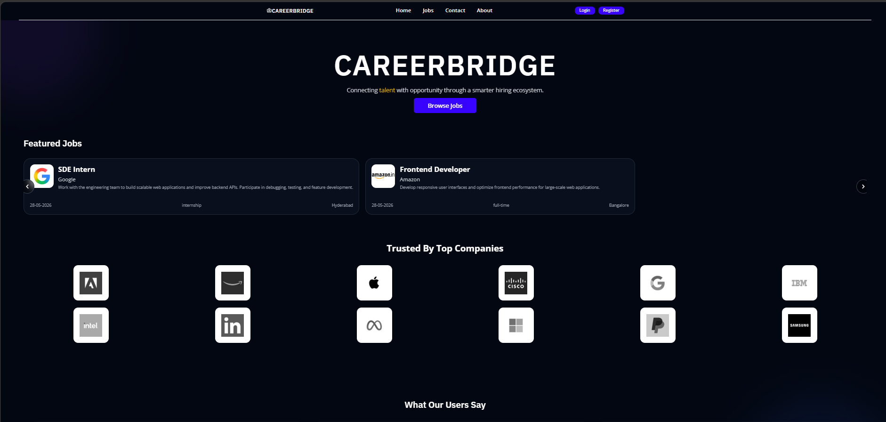
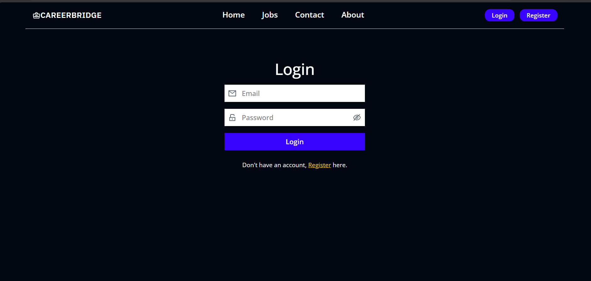
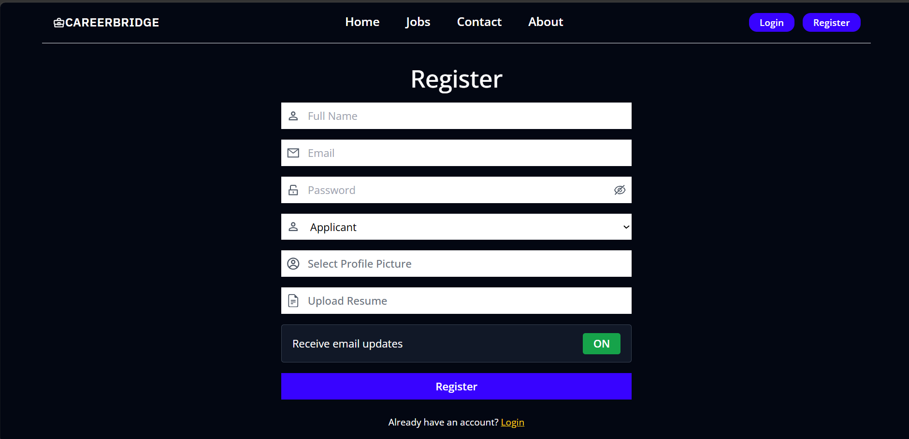
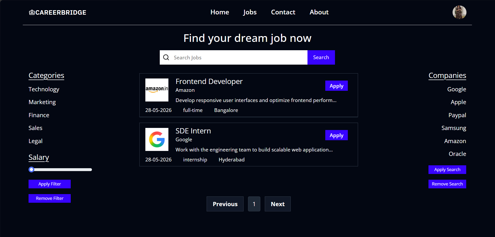
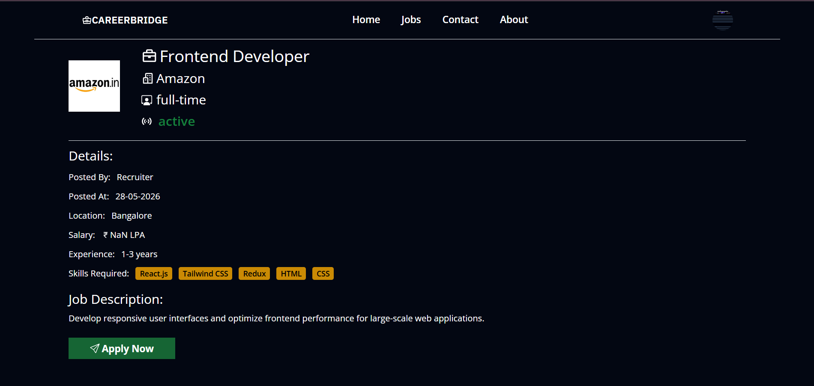
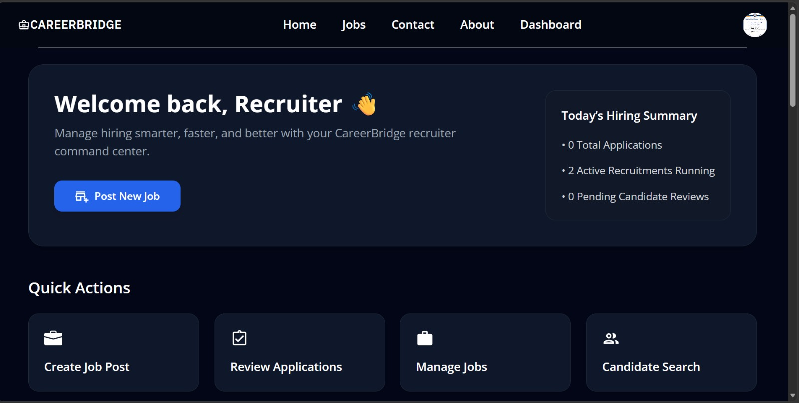
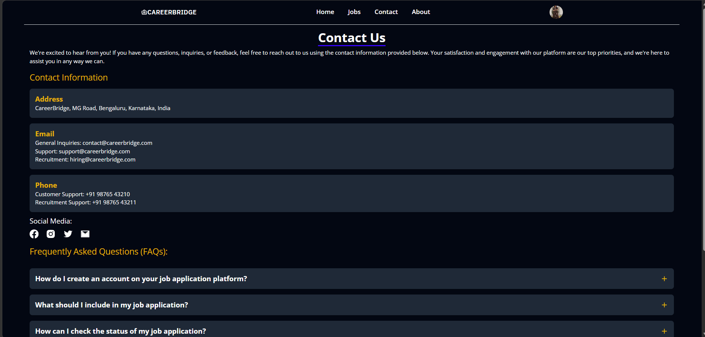

# 🚀 CareerBridge

<p align="center">
  <h3 align="center">A Modern MERN-Based Career & Recruitment Platform</h3>
  <p align="center">
    Connecting talented professionals with trusted recruiters through a secure hiring ecosystem.
  </p>
</p>

---

## 🌐 Live Demo

**Frontend:** 

**Backend API:** https://careerbridge-backend-94u7.onrender.com

---

## 📖 About The Project

CareerBridge is a full-stack recruitment platform designed to simplify the hiring process for applicants, recruiters, and administrators.

The platform introduces a Recruiter Verification Workflow where recruiters must be approved by administrators before they can post jobs and manage applications. This prevents unauthorized recruiters from accessing hiring features and creates a safer recruitment environment.

CareerBridge provides role-based access control, secure authentication, job management, resume handling, recruiter moderation, and applicant tracking within a single platform.

---

# ✨ Core Features

## 👨‍💼 Applicant Portal

* User Registration & Login
* JWT Authentication
* Browse Available Jobs
* Search & Filter Jobs
* Apply for Jobs
* Resume Upload & Management
* Profile Management
* Change Password
* Track Applications

---

## 🏢 Recruiter Portal

* Recruiter Registration
* Recruiter Dashboard
* Create Job Listings
* Manage Posted Jobs
* Review Applications
* View Candidate Resumes
* Hiring Analytics
* Edit & Delete Job Posts

---

## 🛡️ Admin Portal

* Admin Dashboard
* Recruiter Approval Workflow
* Recruiter Moderation
* Approve Recruiters
* Reject Recruiters
* Platform Monitoring
* User Monitoring
* Job Monitoring
* Application Monitoring

---

# 🔐 Recruiter Verification Workflow

```text
Recruiter Registration
          │
          ▼
      Pending
          │
 ┌────────┴────────┐
 │                 │
 ▼                 ▼
Approved        Rejected
 │
 ▼
Recruiter Dashboard Access
 │
 ▼
Create & Manage Jobs
```

This workflow ensures only verified recruiters can access hiring features.

---

# 🏗️ System Architecture

```text
React + Redux
      │
      ▼
 REST API
      │
      ▼
Node.js + Express
      │
      ▼
MongoDB Atlas
      │
      ▼
Cloudinary Storage
```

---

# 🛠️ Tech Stack

## Frontend

* React.js
* Redux Toolkit
* Tailwind CSS
* Mantine UI
* Framer Motion
* React Router

## Backend

* Node.js
* Express.js
* JWT Authentication
* Express Validator

## Database

* MongoDB Atlas
* Mongoose ODM

## Cloud Services

* Cloudinary
* Render
* Vercel

---

# 📸 Application Screenshots

## 🏠 Landing Page



---

## 🔑 Login Page



---

## 📝 Registration Page



---

## 💼 Jobs Page



---

## 👨‍💼 Applicant Dashboard



---

## 🏢 Recruiter Dashboard



---

## 📞 Contact Page



---

# 📁 Project Structure

```bash
CareerBridge
│
├── client
│   ├── public
│   ├── src
│   │   ├── actions
│   │   ├── components
│   │   ├── pages
│   │   ├── slices
│   │   └── utils
│
├── server
│   ├── controllers
│   ├── middlewares
│   ├── models
│   ├── routes
│   ├── uploads
│   └── utils
│
├── assets
│
└── README.md
```

---

# ⚙️ Local Setup

## Clone Repository

```bash
git clone https://github.com/SIndhuja-max/CareerBridge.git
cd CareerBridge
```

---

## Frontend Setup

```bash
cd client
npm install
npm run dev
```

---

## Backend Setup

```bash
cd server
npm install
npm run dev
```

---

# 🔑 Environment Variables

Create:

```text
server/config.env
```

Example:

```env
PORT=3000

MONGO_URI=YOUR_MONGODB_URI

JWT_SECRET=YOUR_SECRET_KEY

CLOUDINARY_CLOUD_NAME=YOUR_CLOUDINARY_NAME
CLOUDINARY_API_KEY=YOUR_CLOUDINARY_KEY
CLOUDINARY_API_SECRET=YOUR_CLOUDINARY_SECRET
```

---

# 🚀 Deployment

### Frontend

* Vercel

### Backend

* Render

### Database

* MongoDB Atlas

### File Storage

* Cloudinary

---

# 📈 Future Enhancements

* AI Resume Screening
* Job Recommendation Engine
* Interview Scheduling System
* Real-Time Notifications
* Recruiter Messaging System
* Email Verification
* Two-Factor Authentication

---

# 👨‍💻 Developer

**Sindhuja**

Built and customized using the MERN Stack.

GitHub:
https://github.com/SIndhuja-max

---

# 📄 License

This project is created for educational, learning, and portfolio purposes.

---

<p align="center">
⭐ If you found this project useful, consider giving it a star on GitHub.
</p>
